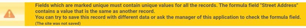

---
hide:
  - navigation
---

# Frequently Asked Questions

 *Updated September 16, 2022*

 DOEE offers regular trainings on how to use the Surface and Groundwater System (SGS). You can find a current list of trainings at [doee.dc.gov/swtraining](https://doee.dc.gov/swtraining).

 **It is against DOEE's policy to share your SGS password or use someone else's account, even if they give you permission. Every user needs to have their own account, which they can create at [doee.dc.gov/sgs](https://doee.dc.gov/sgs). If you need to share projects between multiple people, see Question 23.**

 Please note that you need an SGS account to do most tasks in the system. A few exceptions include reviewing the SRC registry, paying plan fees, and applying for the Clean Rivers IAC Nonprofit Relief Program.

 You can find other instructions, including updated versions of this document, under the **Instructions** tab at [doee.dc.gov/sgs](https://doee.dc.gov/sgs).

## Entering a Plan

[//]: # (## How do I reset my password?)
??? info "1. How do I reset my password?"
    [Instructions to reset your password](../SGS-User-Guide/03-create-manage-account.md#manage-your-password)    

    [//]: # (    To reset your password, go to [doee.dc.gov/sgs]&#40;https://doee.dc.gov/sgs&#41; )
    
    [//]: # (    Under the password field, click the link **I forgot my password**. )
    
    [//]: # (    Enter the email address that your account is under and click **Submit**. )
    
    [//]: # (    You should soon receive an email to reset your password; follow the instructions from there.)
    
    [//]: # (    )
    [//]: # (    If you don't receive an email, please check your spam folder.)

??? info "2. How do I enter and submit a new plan?"
    - [Erosion and Sediment Control & GAR Plan Instructions](../Plans/Erosion-Sediment-Control-Plans/06-submit-a-soil-erosion-and-sediment-control-plan.md)    
    - [Stormwater Management Plan Instructions](../Plans/Stormwater-Management-Plans/07-submit-a-stormwater-management-plan.md)

[//]: # (    Before you begin entering a plan please, review the instruction manuals, which you can find at [doee.dc.gov/sgs]&#40;https://doee.dc.gov/sgs&#41; under the **Instructions** tab.)

[//]: # (    )
[//]: # (    If you are submitting an Erosion and Sediment Control and/or Green Area Ratio plan but not a Stormwater Management Plan, select **Permitting instructions for small projects**.)

[//]: # (    )
[//]: # (    For Stormwater Management Plans, select **Complete Instruction Manual**.)

[//]: # (    )
[//]: # (    You can also attend an [online training]&#40;https://doee.dc.gov/swtraining&#41;. If you still have questions after reading both this document and the instructions, please reach out to [sgs.help@dc.gov]&#40;mailto:sgs.help@dc.gov&#41;.)

??? info "3. How do I save the information I've entered for my plan?"
    
    The page you see after clicking **Erosion, Stormwater, Green Area Ratio and Floodplain**, then **Sites and Plans**, and then **New Site** collects basic information about your project in order to estimate review fees and permitting requirements. Filling this page out by itself is *not* a plan submission.
    
    After filling this page out, you will be taken to a page that will summarize your permitting requirements and provide instructions for creating or requesting access to your project address so you can begin entering the plan. See Questions 26 and 26 for more information on how to request and share site access.

??? info "4. Where do I go to upload my plan set/drawings/other documents?"

    To upload documents to an existing plan:

    1. Log in to the Surface and Groundwater System

    2. Click **Erosion, Stormwater, Green Area Ratio and Floodplain** on your SGS homepage.

    3. Click **Sites and Plans**.

    4. Click on the eye icon to open the plan.

    5. On the plan page, there will be a section called **Plan Documents.** Click the button called **Add Document**.

    6. Select the document type from the **Type of Document** dropdown.
    
    If you are uploading a fee payment receipt, make sure to mark it as **Fee Invoices or Receipts**.

    If a plan has not been entered yet, please see Question 2. This applies for raze permits as well.

??? info "5. I'm trying to upload my plan set documents to my plan; why isn't it working?"

    Depending on your internet connection and the file size, the upload may time out and give you an error. Typically, files over 100 MB will result in this error.
    
    If you receive this error, separate your file into smaller parts and upload them as "1 of 3," "2 of 3" etc. For plan sets, include the cover page as the first page of each part.
    
    If a plan has not been entered yet, please see Question 2. This applies for raze permits as well.

??? info "6. I'm trying to begin entering my project into the Surface and Groundwater System (SGS); why can't I see the site in my list of sites?"

    If you don't see the site in your list, then you need to either create it or get access to it.

    1.  Click **Erosion, Stormwater, Green Area Ratio and Floodplain**

    2.  Click **Sites and Plans**

    3.  Click **New Site**

    4.  Enter in the site address and click **Populate data from address**

    5.  Fill out some of your project information

    6.  Click **Save & close**

    If DOEE already has records identifying a site owner or manager at your address, this person will need to authorize you to act as their agent. 
    You will see a button that says **Request access to this site**. Click this button to request to be an agent of the site owner. 
    You can also follow the instructions in Question 26 to make this request. This step needs to be completed before you will be able to access the site.

    If there is no site owner currently listed, clicking **Request access to this site** will automatically give you access to the site.
    If you do not see the **Request access to this site** button, then you can continue to create the site.

??? info "7. I'm trying to access a site record to upload my Erosion and Sediment Control (ESC) plan, but I can't get access to the site record. How do I get access?"

    If there's no site owner listed and there are *only* ESC plans at the site, see Question 6. If you are still unable to get access to the     site, email [sgs.help@dc.gov](mailto:sgs.help@dc.gov) to request access.

    If there is a site owner listed for the site or the site has Stormwater Management Plans associated with it, see Question 26.

??? info "8. Who should be listed as the site owner?"

    The site owner should be the person who has long-term management and maintenance responsibility for the site once the project completes     construction. This is the person DOEE will contact years after project completion about maintenance inspections or if there is any issue with     maintenance. An engineer, architect, general contractor, or construction manager should not list themself as the site owner unless they are     responsible for managing the project after completion. If they list themselves as the site owner, DOEE will require that the correct person be     listed.

    If the site is going to be sold soon after construction completion, the current site owner still needs to be listed. The current site owner is     required to sign the maintenance responsibility statement, declaration of covenant, and other documents during the plan submittal process.

??? info "9. I'm an engineer entering a Stormwater Management Plan. How do I get my client listed as the site owner?" 

    When you submit a request to create an agent relationship, the site owner receives a request to approve the agent relationship and to confirm site     ownership. Once site ownership is confirmed, the site owner will be recorded in the Surface and Groundwater System (SGS). For the steps to create     an agent relationship, see Question 26. DOEE recommends not waiting until the last minute to get the site owner listed. Stormwater Management     Plans cannot be submitted, for the first time or for a resubmission, without having the site owner listed.

??? info "10. I'm entering an Erosion and Sediment Control (ESC) only plan. What should I enter in the land cover section?"

     For ESC only plans, the land cover types and square footages should be entered in the section called **Land Cover**. There are three types: natural (forest or meadow); compacted (grass and landscaped areas); and impervious (driveways, roofs, patios, etc). Do not just enter the total square footage of your project as natural; you'll need to enter the correct values into each section.
    
     The **total pre project area** and **total post project area** need to be equal before you will be able to save your changes.
    
     Do not include any building renovation square footage in the **Impervious** field. Enter that in the **Building footprint** field in the **Project Description** section.

??? info "11. How do I edit my Erosion and Sediment Control (ESC) plan?"
      
    To edit an ESC plan, the plan needs to have already been created in the Surface and Groundwater System (SGS) and you need to have access to the plan in the SGS:
 
    -   If the plan hasn't been created yet, see Question 2.

    -   If you do not have access to the plan in the SGS, see Question 6.

    -   If your ESC plan has been approved, see Question 19.

    If you have access to the plan and the plan has not been approved yet, you can edit the plan:

    1.  Log in to the SGS.

    2.  Click **Erosion, Stormwater, Green Area Ratio and Floodplain.**

    3.  Click **Sites and Plans**.

    4.  In the **All Plans** section, click the eye icon next to your plan.

    5.  Once the next page loads, click the **Edit** button at the top of the page next to the **Refresh** button.

??? info "12. Why am I getting a Major Substantial Improvement/Major Land Disturbing error when I try to submit? I'm entering an Erosion and Sediment Control (ESC) only plan."

    Check your land cover values that are in the plan. In the **Land Cover** section you should only enter the number of square feet that are being disturbed, not the total lot area.
    
    If you've entered a square footage value into the **Building footprint** field in the **Project Description** section, *do not* also add that value in the **Impervious** field in the **Land Cover** section. The system will double count the value and increase the total area of your project. If this crosses a certain threshold, the system will flag the plan as needing a Stormwater Management Plan.
    
    If you're doing utility work, make sure you fill in the field **Portion of land disturbance that is solely utility work (square feet)** in the **Land Cover** section.

??? info "13. Where do I find the EIF form?"

    You can find the EIF form [here]. 
    It needs to be signed and uploaded to the SGS.

??? info "14. How do I check on my plan status?"

    Log in to the Surface and Groundwater System (SGS). Click **Erosion, Stormwater, Green Area Ratio and Floodplain**, then **Sites and Plans**. On the next page, click the eye icon next to the plan number to open the plan.
    
    Scroll down to the **Plan Review** section. The bottom-most line will show the most recent plan status.

??? info "15. I submitted my Erosion and Sediment Control plan more than 30 business days ago and still have not received any comments. When will I hear back?"

    Make sure your project has been submitted to DCRA through ProjectDox. DOEE review only begins after this has been completed. If you have questions relating to your ProjectDox status, please reach out to Nykia Barnes at [nykia.barnes@dc.gov](mailto:nykia.barnes@dc.gov) or Saba Gharavi at [saba.gharavi@dc.gov](mailto:saba.gharavi@dc.gov).

??? info "16. Who should sign the Maintenance Responsibility and Off-Site Retention Volume Statements for Stormwater Management Plans?"

    The maintenance responsibility statement and the Off-Site Retention Volume statement (if applicable) should be signed by the person listed as \"site owner or manager\" for the site in the Surface and Groundwater System (SGS). In most cases this should be the property owner, although it is acceptable to list a long-term property manager. The person who signs these statements becomes legally responsible for ensuring maintenance and off-site retention volume compliance once the project completes construction. These statements cannot be signed by the engineer, architect, construction manager, contractor, or landscaping company that has been hired to perform maintenance.

??? info "17. How do I sign the Maintenance Responsibility Statement for my Stormwater Management Plan?"

    Log in to the Surface and Groundwater System (SGS). Click **Erosion, Stormwater, Green Area Ratio and Floodplain**, then **Sites and Plans**. On the next page, click the eye icon next to the plan number to open the plan.
    
    Scroll down to the **BMPs** section and click the button **Sign Maintenance Responsibility Stamp**. Fill out the next page and **Save**.

??? info "18. How do I sign the Offv Statement for my Stormwater Management Plan?"

    Log in to the Surface and Groundwater System (SGS). Click **Erosion, Stormwater, Green Area Ratio and Floodplain**, then **Sites and Plans**. On the next page, click the eye icon next to the plan number to open the plan.
    
    Scroll down to the **Summary, Offv, and SRCs** section and click the button **Sign Offv Statement**. Fill out the next page and **Save**.

??? info "19. How do I edit an approved plan?"

    The plan reviewer needs to return the plan before you will be able to edit it.

??? info "20. Why can't I edit my best management practice (BMP)?"

    Once your project begins construction and DOEE has inspected your BMP, it will be locked from editing in the Surface and Groundwater System (SGS). Please email your BMP changes to your plan reviewer so they can update it on your behalf in the SGS.
    
    For each BMP that needs to be edited, specify each value that needs to be updated (including pre- and post-project land cover values, storage volume, etc.), and also specify the existing values.
    
    Please note that any Site Drainage Areas can still be edited without DOEE's assistance.
    
    If any BMP type has changed, for example a bioretention was changed to a tree planting, DOEE will remove the old BMP but you will need to enter in the new BMP. DOEE must be notified of this change for it to occur.

??? info "21. How do I upload my as-built?"

    The final inspection must have occurred, and the inspector needs to have entered it into your plan. Your plan must also be approved.
    
    To upload the as-built, log in to the Surface and Groundwater System (SGS) and click **Erosion, Stormwater, Green Area Ratio and Floodplain**, then click **Sites and Plans**. In the **All Plans** section, click the eye icon next to your plan to open it. Scroll down to the **Plan Documents** section and click the button **Submit As-built**. You cannot use the **Add Document** button. When attaching your as-built, make sure you select "as-built" as the type of document.

## Errors

??? info "22. I'm trying to create a new site, but I'm getting an error. What do I do?"

    You'll need to fix the error before you can move on and enter the plan.
    
    The most common error is shown below. This error means that we already have a record of that site in the Surface and Groundwater System (SGS) and you're trying to enter a duplicate site. If this is for a Stormwater Management Plan, you'll need to send an agent request to the site owner (see Question 26 for more information). If this is for Erosion and Sediment Control only, email [sgs.help@dc.gov](mailto:sgs.help@dc.gov). 
    If you're receiving a different error, see Question 23.

    
??? info "23. I'm getting an error that says "Access Needed" or "Ticket Expired." What do I do?"

    First, clear your cache.
    
    If that doesn't work, open the SGS in an incognito window in Chrome.
    
    If none of the above work, submit a help ticket using the link **Need help? Click here for assistance** on the log in screen at [doee.dc.gov/sgs](https://doee.dc.gov/sgs).

## Getting and Sharing Access to a Site/Plan

??? info "24. Can I share a Surface and Groundwater System (SGS) account with my employees, co-workers, clients or a project team?"

    No, each person using the SGS must have an account registered under their own name, and can only use that account to access the SGS. This is because the SGS is used to electronically sign legally binding agreements. If you share your account with others or use an account registered in someone else's name DOEE may disable that account or take further action.

??? info "25. Multiple people need to view or work on a project that I've entered into the Surface and Groundwater System (SGS). How can I give them access?"

    DOEE policy requires each person accessing the SGS to do so using an account registered in their own name. However, most projects require multiple people to be able to access the plans. There are two ways to grant shared access to a plan.
    
    For people in different organizations, such as the site owner and engineers working on the project, an agent relationship can be created. The site owner determines the amount of access for each agent. To create this relationship, see Question 26.
    
    For people within the same organization, the person managing an organization account can add staff. These staff will have access to everything that the organization account manager has access to. To add staff, see Question 27.

??? info "26. How do I create an agent relationship?"

    Log in to the Surface and Groundwater System(SGS) and click **Erosion, Stormwater, Green Area Ratio and Floodplain** on your homepage, then click **Agents and Staff**.
    
    If you are anyone other than the site owner, click **I am an agent for someone** and enter in the site owner's information and click **Submit**. Once the site owner confirms, the agent relationship has been made.
    
    If you are the site owner, click **Add an agent** and enter in their information and click **Submit**. Once the agent confirms, the agent relationship has been made.
    
    The site owner can grant different levels of access and permission, including to all the sites they own or just to specific ones. These permissions can include Stormwater Retention Credit (SRC) tasks as well.
    
    An agent can also grant access and permission to a subagent. The subagent relationship is specific to one site, so you must create a new relationship for each site.

??? info "27. How do I give staff on my team access to plan or site information?"

    If you haven't already, you'll first need to identify a team member who will manage an organization account on behalf of your organization. If you already have an account that you'd like to make an organization account, please email Brandon Hunt at [brandon.hunt@dc.gov](mailto:brandon.hunt@dc.gov). Otherwise, create an account and select **Yes** in the dropdown under **Create an Organization Account**.
    
    Once this is set up, the organization account manager can add staff by logging in to the Surface and Groundwater System (SGS). On the SGS homepage, click **Erosion, Stormwater, Green Area Ratio and Floodplain** on your homepage, then **Agents and Staff** and then **Add my organization's staff**. Fill out the subsequent page.
    
    Each user added as a staff member will have access to every site listed under the organization account.

## Certified Landscape Expert Process

??? info "28. I'm a site owner/engineer for the plan and I need to add/update certified landscape expert (CLE) information on an existing plan. How do I make the change?"

    Under the CLE Information section of the plan, click the **Add/edit CLE information** button. You should then be able to add/edit the CLE information.

??? info "29. I am a Certified Landscape Expert (CLE) and I got the email to sign the Green Area Ratio (GAR) checklist. What steps do I need to take to sign a GAR document?"

    *Please read these instructions in their entirety before completing the GAR checklist*

    1.  Before the CLE can sign the GAR Checklist statements, they must create a Surface and Groundwater System (SGS) account if they do not have one     already. Go to [doee.dc.gov/sgs](https://doee.dc.gov/sgs) to create an account. The email entered in the CLE information section of the plan **must match the email     associated with the CLE's account** in order for you to access the project. Creating an account does not automatically grant the CLE access to     projects in the SGS (see Step 2).

    2.  Before signing the checklist statement, the CLE must make sure that your contact information and GAR required licensing credentials are entered     in the SGS plan under the **CLE Information** section. If the CLE information is not shown in the GAR checklist or if it shows the wrong     information, click the **Update CLE information** link in the email and enter the correct information. You cannot update the checklist itself.     The information is automatically populated from the plan page in the SGS.

     a. During plan entry, the project owner or their agent enters the CLE information by clicking the **Add/edit CLE information** button on the     plan form. If the construction CLE is unknown at the time, then the design CLE's information will automatically populate the construction section.     An SGS error will appear preventing plan approval if the credentials are not provided.

     b. If the project was approved prior to May 5, 2020, the CLE's credential information must be entered in the SGS before signing the GAR     checklist. On the project page, click the **Add/edit CLE information** button to add the required information before signing the GAR Checklist.

    3.  When DOEE's inspector completes the final GAR inspection, the CLE will receive an email requesting their signature on the landscape checklist.     The CLE will click the link in the email and enter their login credentials.

    4.  On the page that opens, click the **Edit** button at the top of the page, then complete all required questions on the landscape checklist.     The SGS will automatically fill the credential information into the GAR Checklist. When the form is saved, the CLE's electronic signature will be     applied.

    5.  Once the CLE saves the form, the DOEE inspector can sign the landscape checklist. After this is done the CLE will receive a completed copy of     the GAR Landscape Checklist via email.

## Fees

??? info "30. When will my Erosion and Sediment Control (ESC) plan get assigned to a reviewer and/or have fees generated?"

    DOEE fees for ESC plans are generated at the end of the review process.
    
    If you have not already initiated a permit application at DCRA, please contact Julienne Bautista at [julienne.bautista@dc.gov](mailto:julienne.bautista@dc.gov) to assign the project to a reviewer. Public-right-of-way ESC projects still need to apply for a DCRA permit.

??? info "31. How do I pay my fees?" 

    *How to pay your fees online*
    
      When a fee is assessed, the Surface and Groundwater System (SGS) will send an email notification to the person identified as the site owner and the person who submitted the plan. This notification will include a link that you can use to view any fees associated with that plan and pay them through the online payment platform. This platform accepts both Visa and MasterCard. The system may time out after 1 minute.
      
      You can also look up fees for any plan using the DOEE plan number or fee ID number (available in the fee invoice). To do this, go to [doee.dc.gov/sgs](doee.dc.gov/sgs) and click on the blue **Pay Fees** button on the login page (if you are not logged in or do not have an SGS account) or on your SGS home page (if you are logged into your account). Enter either the DOEE plan number or fee ID and click **Display Report**. If the fee still needs to be paid, there will be a blue button called **Pay Fee.** Click it to begin the payment process.
      
      Note that you do not need to log into your SGS account to pay the fees, but you will need to log into view fee assessment details or download a PDF invoice. To download a PDF invoice, see Question 32.
      
      You can find these instructions online, along with more fee information, [here](https://doee.dc.gov/service/swreviewfees#%3A%7E%3Atext%3Da%20PDF%20invoice.-%2CIn%20Person%3A%2C-You%20can%20pay).

    *How to pay your fees in person*
    
      You can also pay fees in person at 1101 4^th^ Street SW Washington, DC 20024. You will need two copies of the invoice and a copy of the SOAR revenue/receipts for each requirement your plan has: SWMP, ESC, and/or GAR. For example, an Erosion and Sediment Control (ESC) only plan will need two copies of the invoice and one copy of the SOAR receipt for their ESC fees. A Stormwater Management and ESC plan will need two copies of the invoice and one SOAR receipt for the Stormwater Management fees, and two copies of the invoice and one SOAR receipt for the ESC fees, etc. If you don't have these documents with you, you won't be able to pay the fee. See Question 32 for how to access your fee invoice.
      
      Once your fee has been paid, log into the SGS and upload a copy of the receipt to the plan. See Question 4 for more information.
      
      You can find these instructions online, along with more fee information, [here][33].

??? info "32. How do I find the invoice and SOAR receipt for a fee?"

    You will need access to the plan in order to access the fee invoice. See Questions 26 and 27 for different ways to get access to the plan.
    
    Once you have access, click on **Erosion, Stormwater, Green Area Ratio and Floodplain** on your SGS homepage, then click **Sites and Plans**. On the next page, open the plan by clicking the eye icon. Under the **Fees** section, click the eye icon next to the fee record. This will open the fee page, where you should see a button called **SOAR REVENUE/RECEIPTS** and another button called **ESC Fee Invoice**. Please note that if you're paying the fee in person, you need two copies of the invoice and one copy of the SOAR receipt for each requirement your plan has: SWMP, ESC, and/or GAR.
    
    You can also access a fee invoice through the **Pay Fees** button. Go to [doee.dc.gov/sgs](https://doee.dc.gov/sgs) and click **Pay Fees** under the log in section. Enter in either the DOEE plan number or the fee ID. If the fee has been paid, you will see a button called **Additional fee details (required SGS account)**. Click this to open the fee page, where you should see a button called **SOAR REVENUE/RECEIPTS** and another button called **ESC Fee Invoice**. Note that in order to access the invoice and SOAR receipt this way, you need to have an SGS account and access to the plan.

## Changing Property Ownership in the Surface and Groundwater System (SGS)

??? info "33. I have sold a property for which I am listed as Site Owner in the Surface and Groundwater System (SGS), or someone else within my organization is taking over responsibility for managing a property. How do I notify DOEE of the change?"

    You can notify DOEE of changes in site ownership or management through the SGS. Log in, and then click **Erosion, Stormwater, Green Area Ratio and Floodplain**, then **Sites and Plans**, then **Notify DOEE of a Change in Site Ownership or Management**. You may need to scroll down a bit to some of these buttons. On the next page, click **Ownership or Management has Changed** next to the site that had the change and then fill out and save the next page. You will need to provide the new site owner or manager's contact information and the transfer date if a sale occurred. DOEE may reach out to you and/or the new site owner or manager within two business days to confirm the transfer and inform you of any next steps, if needed. This process is streamlined if either the current or the new site owner submits this change.
    
    Please note: engineers, architects, or other project designers cannot be listed as site owners. See Question 8 for more information.

??? info "34. I submitted a Notify DOEE of a Change in Site Ownership or Management request, but it hasn't been updated in the SGS. What do I do next?"

    Submitting this notification will not automatically update the site. DOEE needs to manually make the change before you will see the change in the SGS. DOEE may reach out to you for clarification or confirmation if necessary.

[//]: # ()
[//]: # (  [doee.dc.gov/swtraining]: https://doee.dc.gov/swtraining)

[//]: # (  [doee.dc.gov/sgs]: https://octo.quickbase.com/up/bjezqjzuy/g/rbe/eg/va/Log_In.html)

[//]: # (  [1]: http://doee.dc.gov/sgs)

[//]: # (  [4]: #entering-a-plan)

[//]: # (  [2]: #how-do-i-reset-my-password)

[//]: # (  [3]: #how-do-i-enter-in-and-submit-a-new-plan)

[//]: # (  [5]: #_Toc114145598)

[//]: # (  [5]: #where-do-i-go-to-upload-my-plan-setdrawingsother-documents)

[//]: # (  [6]: #im-trying-to-upload-my-plan-set-documents-to-my-plan-why-isnt-it-working)

[//]: # (  [7]: #im-trying-to-begin-entering-my-project-into-the-surface-and-groundwater-system-sgs-why-cant-i-see-the-site-in-my-list-of-sites)

[//]: # (  [6]: #im-trying-to-access-a-site-record-to-upload-my-erosion-and-sediment-control-esc-plan-but-i-cant-get-access-to-the-site-record.-how-do-i-get-access)

[//]: # (  [8]: #who-should-be-listed-as-the-site-owner)

[//]: # (  [7]: #im-an-engineer-entering-a-stormwater-management-plan.-how-do-i-get-my-client-listed-as-the-site-owner)

[//]: # (  [9]: #im-entering-an-erosion-and-sediment-control-esc-only-plan.-what-should-i-enter-in-the-land-cover-section)

[//]: # (  [10]: #how-do-i-edit-my-erosion-and-sediment-control-esc-plan)

[//]: # (  [8]: #why-am-i-getting-a-major-substantial-improvementmajor-land-disturbing-error-when-i-try-to-submit-im-entering-an-erosion-and-sediment-control-esc-only-plan.)

[//]: # (  [11]: #where-do-i-find-the-eif-form)

[//]: # (  [12]: #how-do-i-check-on-my-plan-status)

[//]: # (  [13]: #i-submitted-my-erosion-and-sediment-control-plan-more-than-30-business-days-ago-and-still-have-not-received-any-comments.-when-will-i-hear-back)

[//]: # (  [9]: #who-should-sign-the-maintenance-responsibility-and-off-site-retention-volume-statements-for-stormwater-management-plans)

[//]: # (  [14]: #how-do-i-sign-the-maintenance-responsibility-statement-for-my-stormwater-management-plan)

[//]: # (  [15]: #how-do-i-sign-the-offv-statement-for-my-stormwater-management-plan)

[//]: # (  [16]: #how-do-i-edit-an-approved-plan)

[//]: # (  [10]: #why-cant-i-edit-my-best-management-practice-bmp)

[//]: # (  [17]: #how-do-i-upload-my-as-built)

[//]: # (  [18]: #errors)

[//]: # (  [19]: #im-trying-to-create-a-new-site-but-im-getting-an-error.-what-do-i-do)

[//]: # (  [11]: #im-getting-an-error-that-says-access-needed-or-ticket-expired.-what-do-i-do)

[//]: # (  [20]: #getting-and-sharing-access-to-a-siteplan)

[//]: # (  [21]: #can-i-share-a-surface-and-groundwater-system-sgs-account-with-my-employees-co-workers-clients-or-a-project-team)

[//]: # (  [22]: #multiple-people-need-to-view-or-work-on-a-project-that-ive-entered-into-the-surface-and-groundwater-system-sgs.-how-can-i-give-them-access)

[//]: # (  [12]: #how-do-i-create-an-agent-relationship)

[//]: # (  [23]: #how-do-i-give-staff-on-my-team-access-to-plan-or-site-information)

[//]: # (  [13]: #certified-landscape-expert-process)

[//]: # (  [24]: #im-a-site-ownerengineer-for-the-plan-and-i-need-to-addupdate-certified-landscape-expert-cle-information-on-an-existing-plan.-how-do-i-make-the-change)

[//]: # (  [25]: #i-am-a-certified-landscape-expert-cle-and-i-got-the-email-to-sign-the-green-area-ratio-gar-checklist.-what-steps-do-i-need-to-take-to-sign-a-gar-document)

[//]: # (  [14]: #fees)

[//]: # (  [26]: #when-will-my-erosion-and-sediment-control-esc-plan-get-assigned-to-a-reviewer-andor-have-fees-generated)

[//]: # (  [27]: #how-do-i-pay-my-fees)

[//]: # (  [15]: #how-do-i-find-the-invoice-and-soar-receipt-for-a-fee)

[//]: # (  [16]: #changing-property-ownership-within-the-surface-and-groundwater-system-sgs)

[//]: # (  [28]: #i-have-sold-a-property-for-which-i-am-listed-as-site-owner-in-the-surface-and-groundwater-system-sgs-or-someone-else-within-my-organization-is-taking-over-responsibility-for-managing-a-property.-how-do-i-notify-doee-of-the-change)

[//]: # (  [29]: #i-submitted-a-notify-doee-of-a-change-in-site-ownership-or-management-request-but-it-hasnt-been-updated-in-the-sgs.-what-do-i-do-next)

[//]: # (  [here]: https://eservices.dcra.dc.gov/DocumentManagementSystem/Home/retrieve?id=Environmental%25252520Intake%25252520Form.pdf)

[//]: # (  [30]: media/image1.png {width="6.5in" height="0.6138888888888889in"})

[//]: # (  [31]: https://dcgovict.sharepoint.com/sites/GITITDOEE/Shared%20Documents/SGS%20-%20SWMP%20and%20ESC%20help/How%20to%20Guides%20&%20Public%20Instructions/SGS%20FAQ/doee.dc.gov/sgs)

[//]: # (  [32]: https://doee.dc.gov/service/swreviewfees#:~:text=Pay%20Stormwater%20Fee-,Online,-%3A%20When%20a%20fee)

[//]: # (  [33]: https://doee.dc.gov/service/swreviewfees#:~:text=a%20PDF%20invoice.-,In%20Person%3A,-You%20can%20pay)
