# Certify SRCs - SGS Application Guide

This guide explains how to apply online to certify Stormwater Retention Credits (SRCs) using the Department of Energy
and Environment's (DOEE's) Surface and Groundwater System (SGS), available at [doee.dc.gov/sgs](http://doee.dc.gov/sgs)

[//]: # (!!! Tip "Before You Start Your Application")
## Before You Start Your Application

[1. Use your own account](#1-use-your-own-account)

[2. Confirm your site access and SRC permissions](#2-confirm-your-site-access-and-SRC-permissions)

[3. Learn how to find your site, plan, and BMP records](#3-learn-how-to-find-your-site-plan-and-bmp-records)

[4. Get your as-built approved](#4-get-your-as-built-approved)

[5. Get your BMP inspections approved](#5-get-your-bmp-inspections-approved)

[6. Prepare your Maintenance Agreement](#6-prepare-your-maintenance-agreement)

[7. Set a value for your SRCs (optional)](#7-set-a-value-for-your-srcs-optional)

[//]: # (!!! Tip "How to Submit Your Application")
## How to Submit Your Application

[1. Create a new application](#1-create-a-new-application)

[2. Edit an existing application](#2-edit-an-existing-application)

[3. Enter general information](#3-enter-general-information)

[4. Enter SRC owner information](#4-enter-src-owner-information)

[5. Select green infrastructure BMPs to generate SRCs](#5-select-green-infrastructure-bmps-to-generate-srcs)

[6. Sign and submit the application](#6-sign-and-submit-the-application)

[7. Apply for RiverSmart Rewards (optional)](#7-apply-for-riversmart-rewards-optional)

## Before Starting the Application

### 1. Use your own account

To use SGS to apply to Certify SRCs, you need to have your own SGS account.

***DO NOT*** share a username or password for an SGS account with someone else. This is against DOEE policy and may lead
to deactivating the shared account. It may also delay your application and require you to re-submit.

If you don't have an SGS account, create one at [doee.dc.gov/sgs](http://doee.dc.gov/sgs).

### 2. Confirm your site access and SRC permissions

To submit a Certify SRCs application, you need to be set up in the SGS as either the site owner or their agent.
3.-Learn-how-to-find-your-site,-plan,-and-BMP-records
- **Site owner** - If your SGS account is listed as the site owner, then you already have SRC permissions and full
  access to the site and can skip to [Step 3](#3-learn-how-to-find-your-site-plan-and-bmp-records). If you are not sure, find out [How to see the sites you own in the SGS](#how-to-open-a-site-or-plan-record-in-the-sgs)

- **Agent of the Site owner with site and SRC permissions -** If you are applying on behalf of the site owner, you first
  need to be set up in the SGS as the site owner's agent. Follow the [Agents & Staff Instructions](../../Agents-Staff-Guide/agents-and-staff-start.md) and make sure the
  site owner provides you with SRC permissions.

If you can't see the plan in the SGS after following the [Instructions to locate a plan](#3-learn-how-to-find-your-site-plan-and-bmp-records), then you need to set up the
correct agent relationship that specifies SRC permissions for that site.

### 3. Learn how to find your site, plan, and BMP records

Before you can apply to Certify SRCs, **you must** already have a DOEE-approved Stormwater Management Plan (SWMP) in the
SGS. To complete this application, you also need to know how to open your SWMP and best management practice (BMP)
records to view or add information.

#### How to open a site or plan record in the SGS

1. Log in to the SGS and click the **Erosion, Stormwater, Green Area Ratio and Floodplain** button.
   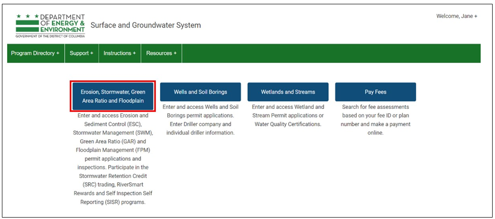

2. Click the **Sites and Plans** button.
   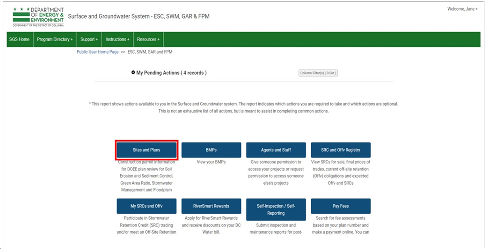

3. In the **My Sites** section or the **All Plans** section, look for the address or plan number to locate the correct
   record.

4. Click the "eye" icon next to the record to open it.
   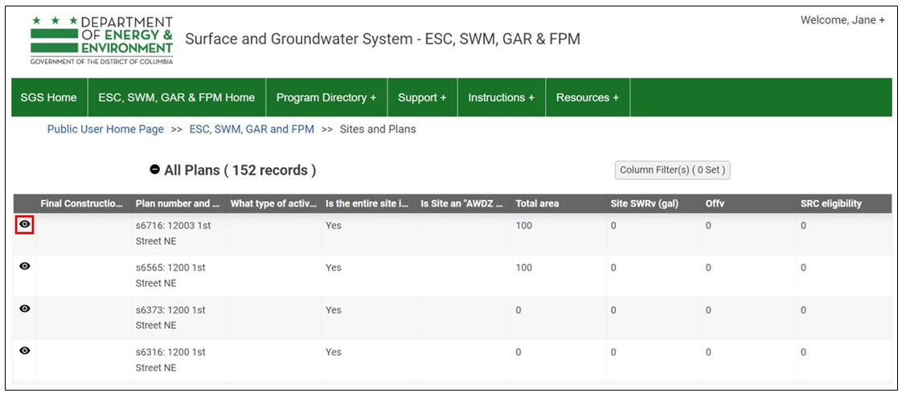

5. If you follow these steps and can't see the plan, you need to [confirm your SGS permissions and access](#2-confirm-your-site-access-and-src-permissions).

#### How to find a list of the BMPs on your SWMP

1. Open the plan record in the SGS ([click here to learn how][20]).

2. Scroll down to the **BMPs** section to see a report of the BMP records, including the type and ID number for each
   one. Click the "eye" icon next to a record to see more detail.
   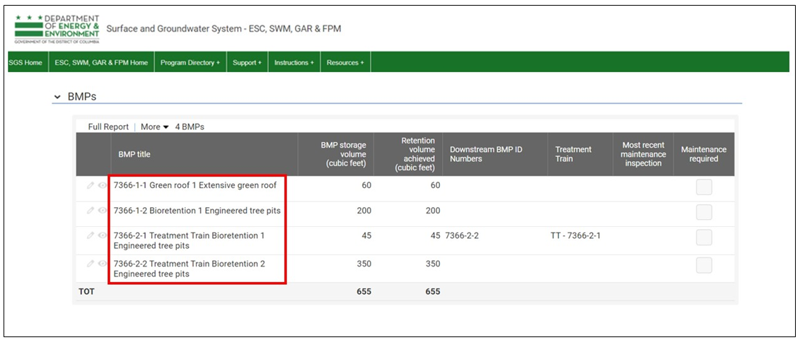

### 4. Get your as-built approved

You are required to have a DOEE-approved as-built Stormwater Management Plan (SWMP) in the SGS before you can complete
an application to Certify SRCs.

To be able to submit the as-built plan for approval, you must first have an approved SWMP with an approved DOEE final
construction inspection in the SGS.

If you know the as-built is already uploaded and approved in the SGS, skip to [Step 5](#5-get-your-bmp-inspections-approved).

#### How to see if the as-built has been uploaded and approved

1. Open the plan record in the SGS ([click here to learn how](#how-to-open-a-site-or-plan-record-in-the-sgs).

2. Scroll down to the **Plan Documents** section and look for entry near the bottom of the list where the column:

    - **File Type** -- says "As-built"

    - **File** -- includes the word "stamped" in the file name, which means it is approved.

    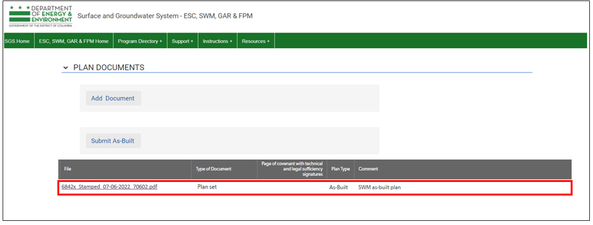

3. If you've found a stamped as-built, skip to [Step 5][6]. If not, you need to [submit the as-built][23].

#### How to submit the as-built

1. Open the plan record in the SGS ([click here to learn how][20]).

2. Scroll down to the **Plan Documents** section and click the **Submit as-built** button (see screenshot on the next
   page).

If you don't see the **Submit as-built** button, check with your:

- DOEE plan reviewer to make sure the plan has been approved in the SGS.

- DOEE inspector to make sure the final construction inspection has been approved in the SGS.

    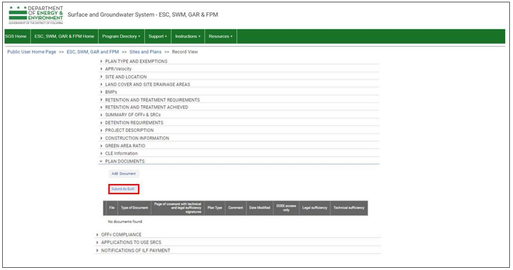

3. Use the **Choose File** button to select the as-built file from your computer and attach it.

4. In the **Type of Document** field, select **as-built**, and then click **Save & close**.

5. Your DOEE inspector will review the as-built for approval and may contact you if there are questions.

    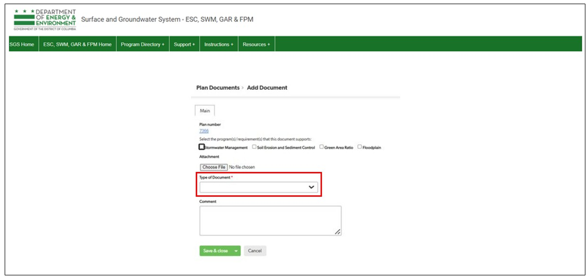

### 5. Get your BMP inspections approved

To apply to Certify SRCs, all stormwater BMPs that are part of the plan must have passed an inspection within the prior
six months that is recorded in the SGS.

#### Is this the first time you are certifying SRCs for this plan?

- If you completed a DOEE final construction inspection or a DOEE maintenance inspection within the past 6 months, you
  have met this requirement and can skip to [Step 6](6-prepare-your-maintenance-agreement).

- If not, you need to contact your DOEE inspector to schedule a new on-site inspection.

#### Have you certified SRCs for this plan before and are applying to re-certify?

- You may have the option to conduct your own BMP inspection(s) and ask DOEE to approve them through the Self-Inspection
  Self-Reporting (SISR) process in the SGS.

[Learn more about SISR](https://doee.dc.gov/service/sisr).

#### How to see if a recent inspection is recorded in the SGS

1. Open the plan record in the SGS ([click here to learn how](#how-to-open-a-site-or-plan-record-in-the-sgs)).

2. Scroll down to the **Inspections** section and look for the most recent inspection date. It could be under **
   Construction Inspections** or **Maintenance Inspections**.

    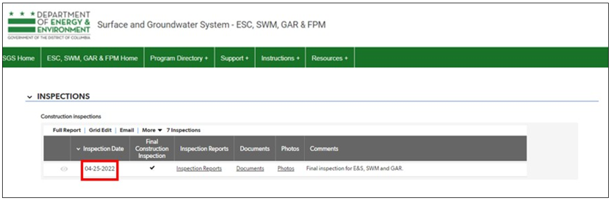

3. If this project is certifying SRCs for first time and the most recent DOEE inspection was more than 6 months ago, you
   will need to contact your DOEE inspector to schedule an on-site inspection.

4. If this project is re-certifying SRCs and the most recent inspection was more than 6 months ago, you need to complete
   SISR.

### 6. Prepare your Maintenance Agreement

You must attach a maintenance agreement that covers the same period as your application to Certify SRCs. See the **
Certify SRCs -- Maintenance Agreement Guide** for instructions.

### 7. Set a value for your SRCs (optional)

If you don't plan to sell SRCs in the [SRC Registry](https://octo.quickbase.com/up/bjkxxcfcp/g/rfp/eg/va/index.html#path=42-10&ar=12) you can skip this step.

If you plan to sell SRCs in the [SRC Registry](https://octo.quickbase.com/up/bjkxxcfcp/g/rfp/eg/va/index.html#path=42-10&ar=12) you will need to list the price per SRC. You can choose any price you
want, but it may be helpful to review the current market values first.

#### How to check current SRC prices

1. Log in to the SGS and click the **Erosion, Stormwater, Green Area Ratio and Floodplain** button*.*

    

2. Click the **SRC and Offv Registry** button.

    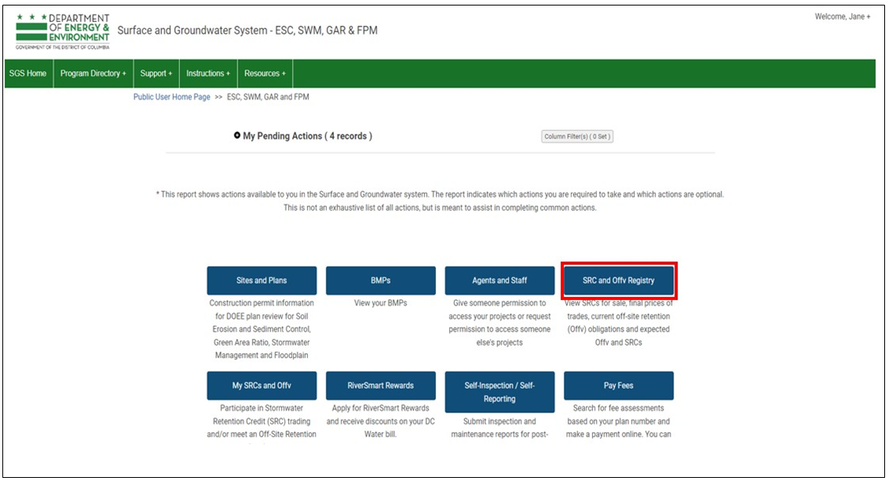

3. To see past sale averages, click the **Final SRC Sale Prices** button.

    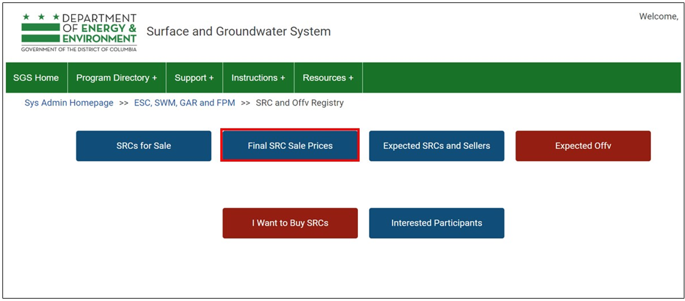

4. To see current price listings, click **SRCs for Sale**.

    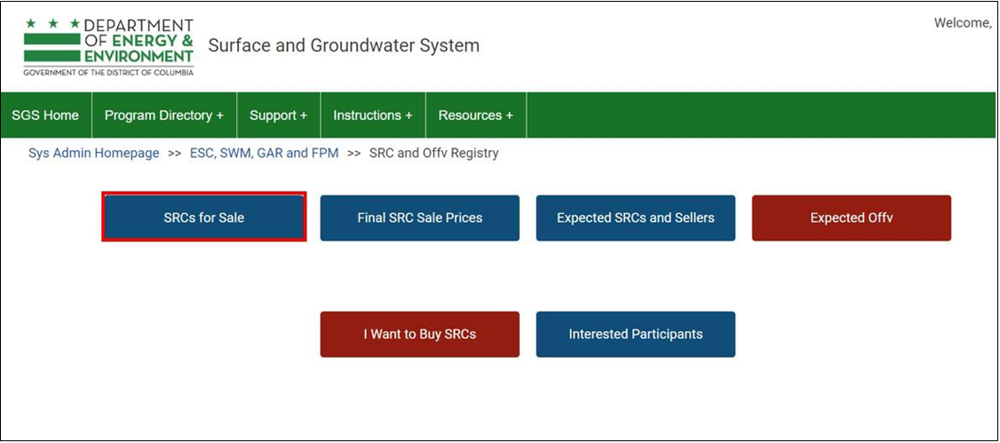

## How to Submit the Application

After you collect all the necessary information, you need to submit your application in the SGS.

### 1. Create a new application

1. Log in to the SGS and click the **Erosion, Stormwater, Green Area Ratio and Floodplain** button.
    
   

2. Click the **My SRCs and Offv** button.

   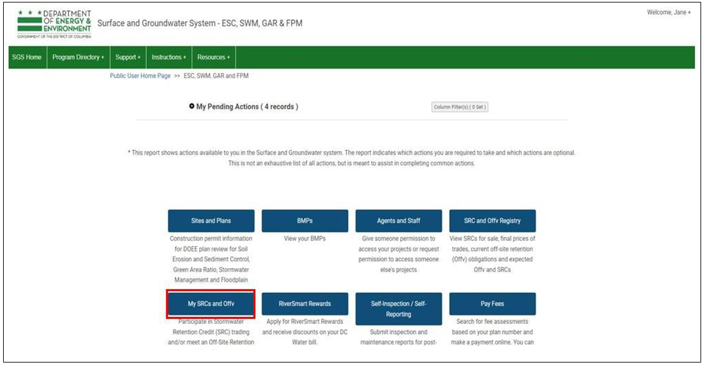

3. Click the **Certify SRCs** button, which will create a new application.

    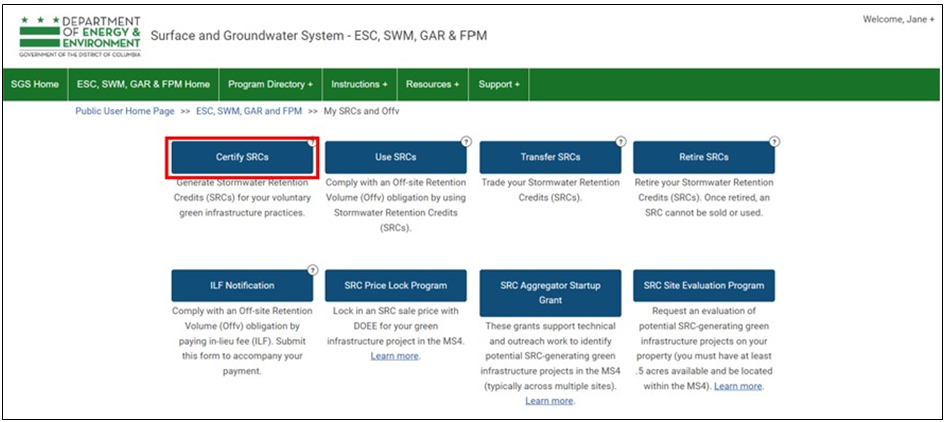

### 2. Edit an existing application

1. Log in to the SGS and click the **Erosion, Stormwater, Green Area Ratio and Floodplain** button.

   

2. Click the **My SRCs and Offv** button.

   

3. Scroll down to the section **SRC Certification Applications** to see your previous application(s).

4. Click the "eye" icon to open the application you want to work on.

    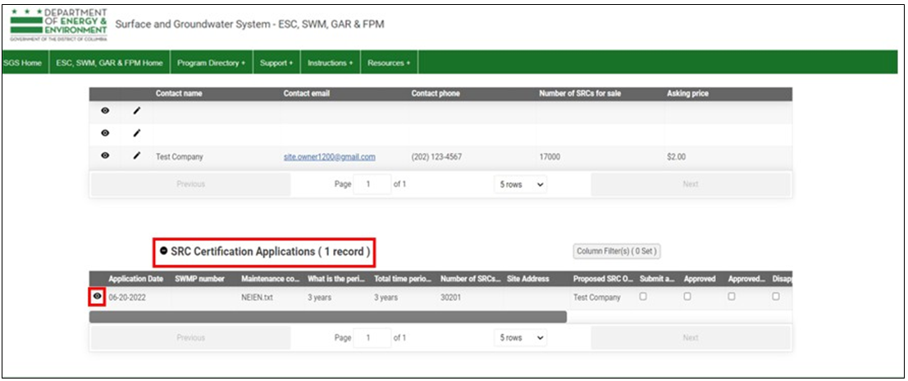

### 3. Enter general information

1. In the field **SWMP number**, select the plan number that has the SRC eligibility you are requesting to certify.

2. In the field **What is the period for which SRCs are requested**, choose either 1, 2, or 3 years to correspond with the dates in your maintenance agreement.

    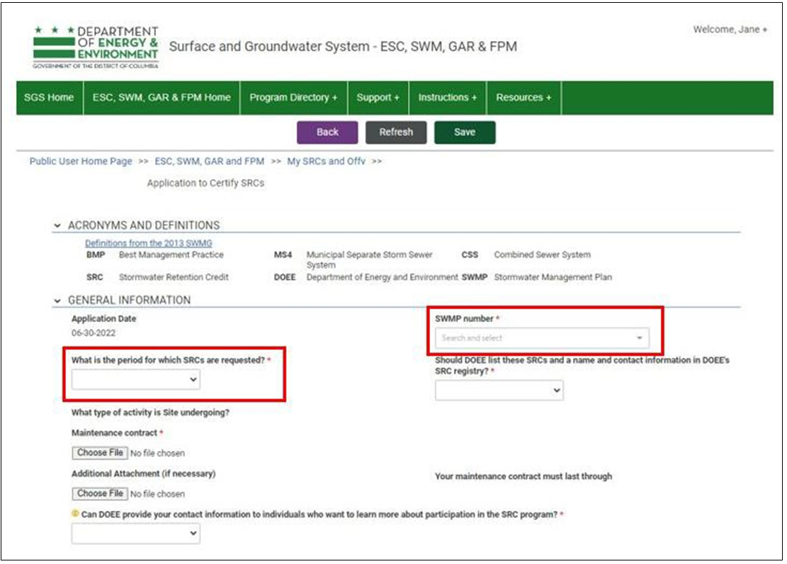

4. In the field **Maintenance contract**, use the **Choose File** button to select the maintenance agreement file from your computer and attach it. If needed, see more information about how to prepare a maintenance agreement.

5. If you would like to attach another document, got to the field **Additional Attachment (if necessary)** and use the **Choose File** button to select it from your computer.

    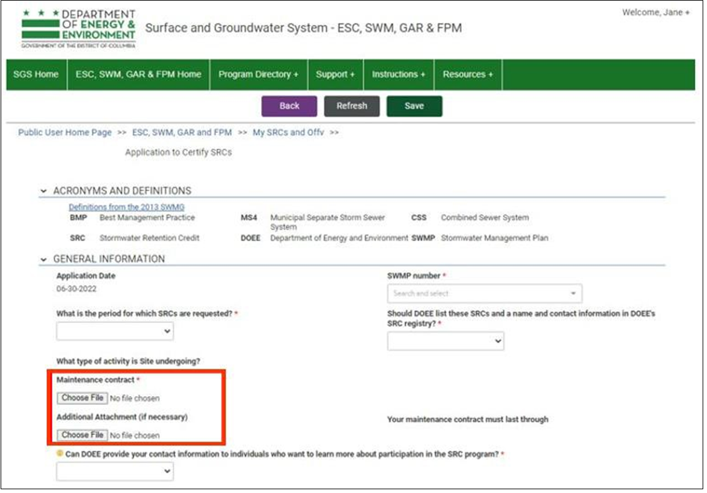

5. In the field **Should DOEE list these SRCs and a name and contact information in DOEE's **SRC registry**, enter:

- **yes** - if you want to sell these SRCs on the registry, or

- **no** - if you want to store these SRCs in your account to use for your other properties

6. If you choose **yes**, a few new fields will appear that you need to complete (see screenshot on next page):

- **What is the asking price for each SRC? (\$)** - enter the price you would like buyers to pay per SRC.

- **Who should be listed?** - select the person whose information should be displayed to interested buyers in the SRC
  registry:

    - Proposed SRC Owner

    - Site Owner

    - Owner of Retention Capacity

    - Agent for Owner of Proposed SRCs

- **Can DOEE provide your contact information to individuals who want to learn more about participation in the SRC
  program?** - choose yes or no.

    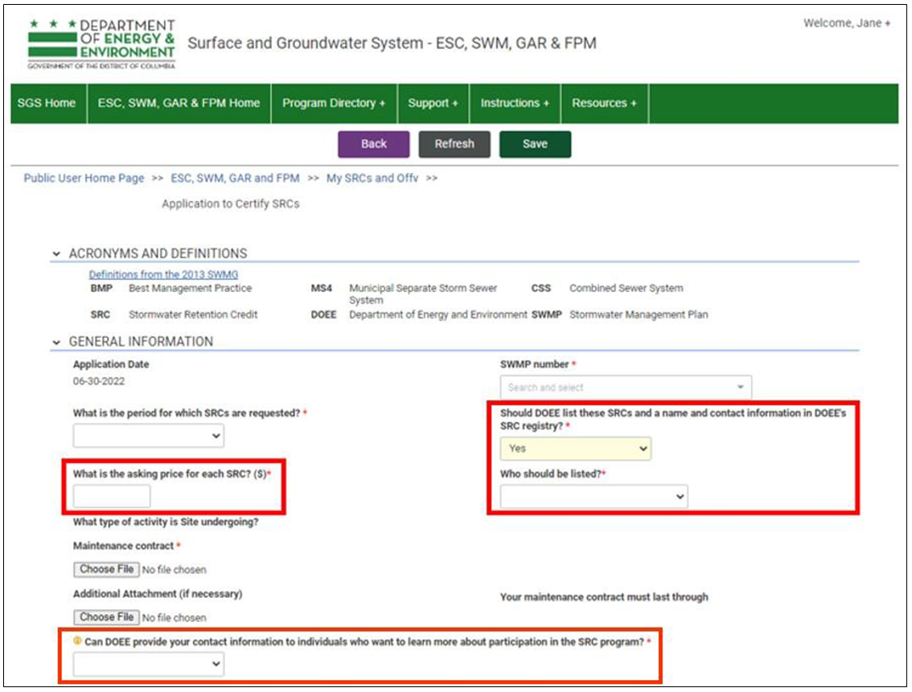

### 4. Enter SRC owner information

(See screenshot on next page.)

1. In the **Proposed SRC Owner** section, choose the owner from the **Name** dropdown. The rest of the fields will fill
   in automatically.

2. In the **Owner of Retention Capacity** section, go to the field **Who owns the retention capacity**
   and select **Site Owner**, **Proposed SRC Owner**, or **Other**.

3. Click **Save**.

    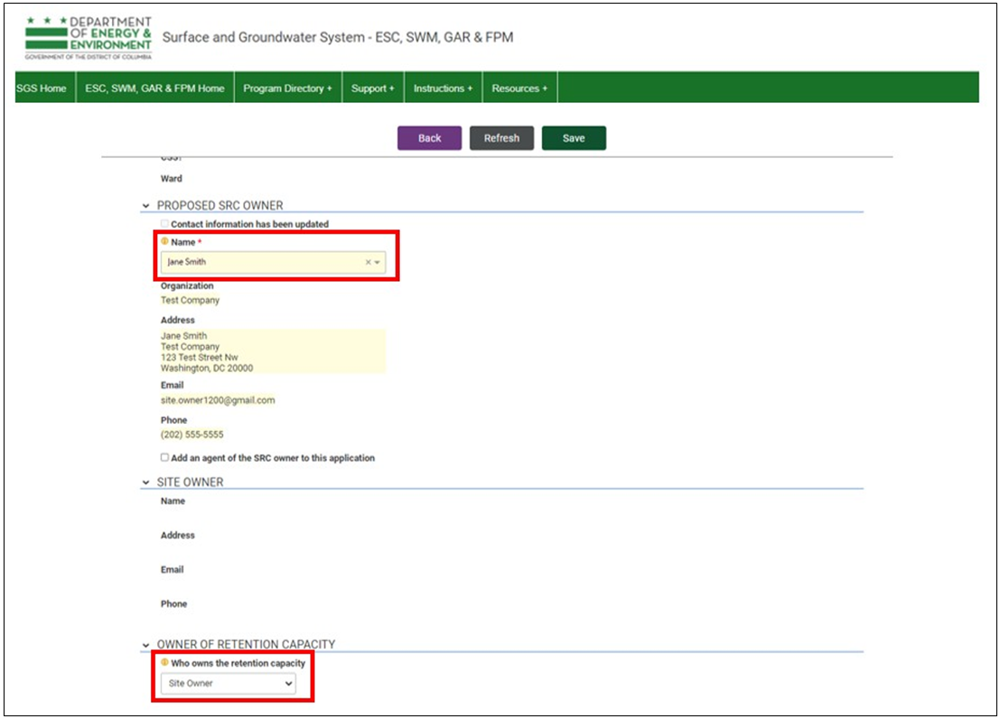

### 5. Select green infrastructure BMPs to generate SRCs

1. Click the **Select BMPs to generate SRCs** button to see a list of the BMPs on the plan that are eligible to certify
   SRCs.

2. Select the BMPs you want to certify SRCs.

    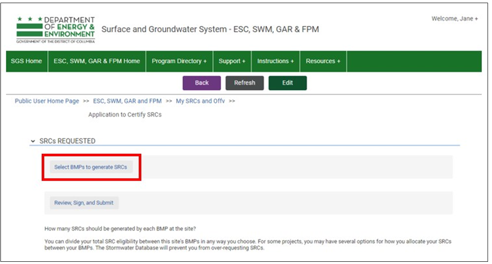

### 6. Sign and submit the application

1. Click **Review, Sign, and Submit**.

    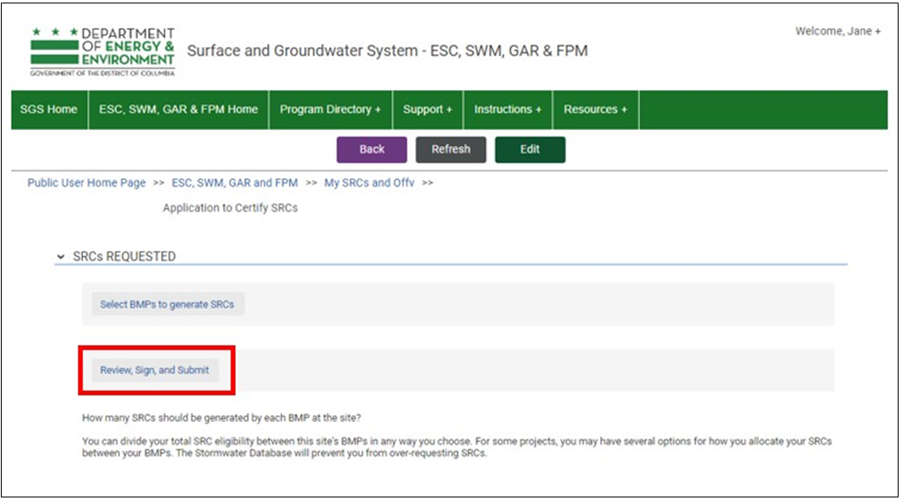

2. This will take you to a page where you can review your application and make sure everything is correct.

3. After double-checking, scroll down and click the **Sign and Submit Application** button.

    

4. Type your name in the **Signature** box.

5. Click **Submit**.

    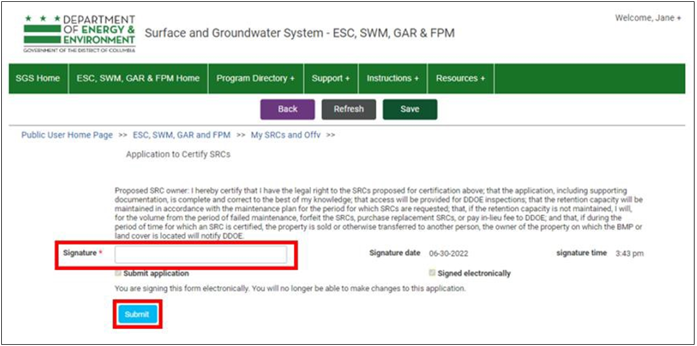

### 7. Apply for RiverSmart Rewards (optional)

After you submit your Certify SRCs application, a new page will open where you have the option to apply for RiverSmart
Rewards to receive a modest discount on your DC Water bill as a benefit for keeping your BMPs in good working order.

1. To apply, click the **Apply for RiverSmart Rewards** button.

    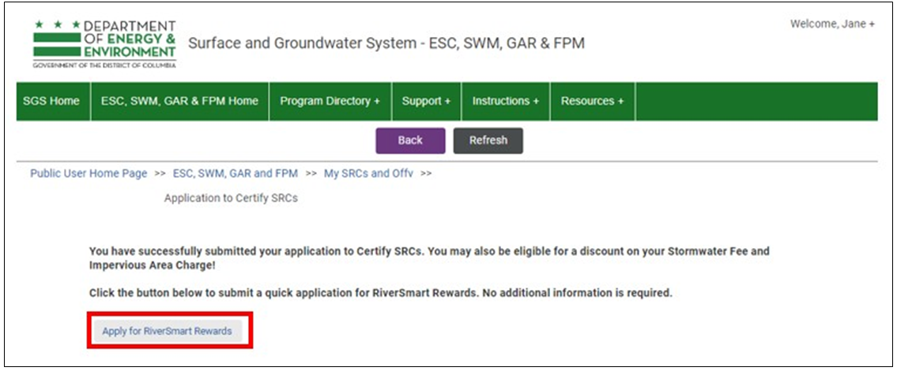

2. Type your name in the **Signature** field.

3. Click the **Submit Application** button.

    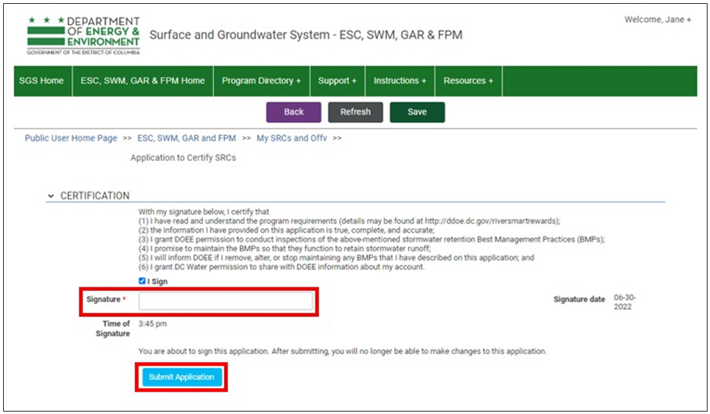

4. If your Certify SRCs application is approved, your RiverSmart Rewards application will be approved automatically as
   well. You will be enrolled for three years and will need to renew after that to keep receiving the discount.