#Transfer SRCs

[//]: # (1.  [**Create a New Transfer SRCs Form**]&#40;#create-a-new-transfer-srcs-form&#41;)
[//]: # (2.  [**Edit an Existing Transfer Form**]&#40;#edit-an-existing-transfer-form&#41;)
[//]: # (3.  [**Confirm the Date to Transfer the SRCs**]&#40;#confirm-the-date-to-transfer-the-srcs&#41;)
[//]: # (4.  [**Enter the Current SRC Owner**]&#40;#enter-the-current-src-owner&#41;)
[//]: # (5.  [**Enter the New SRC Owner**]&#40;#enter-the-new-src-owner&#41;)
[//]: # (6.  [**Select the SRCs to Transfer**]&#40;#select-the-srcs-to-transfer&#41;)
[//]: # (7.  [**Sign and Submit Application**]&#40;#sign-and-submit-application&#41;)

This guide has step-by-step instructions to transfer Stormwater Retention Credits
(SRCs) to a new owner using DOEE's Surface and Groundwater System (SGS).

Please note that if you are not the site owner/SRC owner, you'll need to
[request to be an agent](User-Guides/Agents-Staff-Guide/agents-and-staff-start.md)
of the site owner/SRC owner.

## 1. Create a New Transfer SRCs Form

If you want to edit an existing Transfer SRCs form, skip to [Edit an Existing Transfer Form](#edit-an-existing-transfer-form).
Otherwise, complete this step.

Log in to the SGS. On the SGS home screen, click ***Erosion,
Stormwater, Green Area Ratio and Floodplain***, then click ***My SRCs
and Offv***. Click ***Transfer SRCs*** to open a new Transfer SRCs
form.

Skip to [Step 3](#3-confirm-the-date-to-transfer-the-srcs).

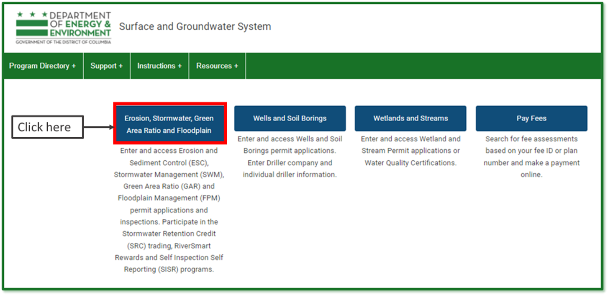

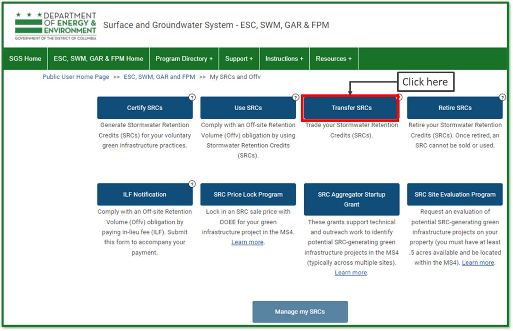

## 2. Edit an Existing Transfer Form

If you have already started a Transfer SRCs form but have not
submitted it yet, log in to the SGS and click ***Erosion, Stormwater,
Green Area Ratio and Floodplain***, then ***My SRCs and Offv***. **Do
not click** the button ***Transfer SRCs***.

Scroll down to the section called ***SRC Transfer
Applications***. This is where all your in- progress and complete SRC
Use forms will be listed. Click the pencil icon next to the form you
want to edit.

**Note:** If you click the ***Transfer SRCs*** button, it will start a
new form instead of opening an existing one. If this happens, simply
click ***Cancel*** to exit and remove the new form.

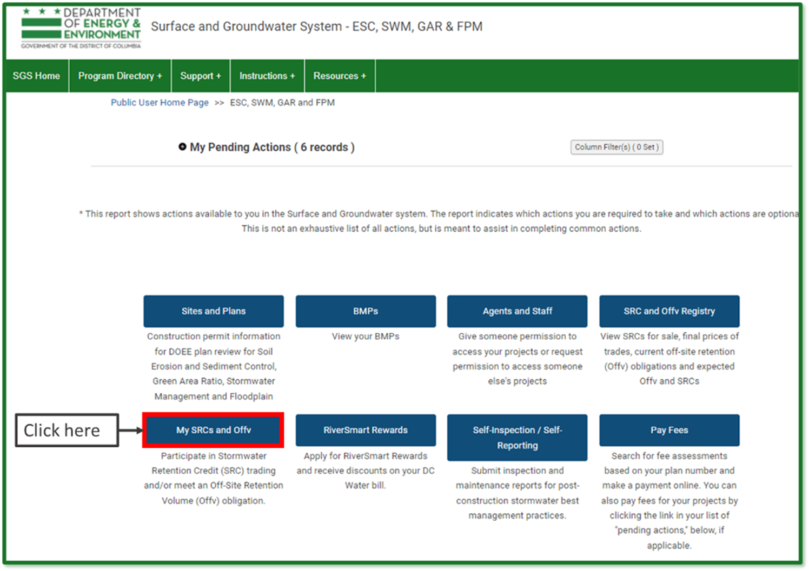
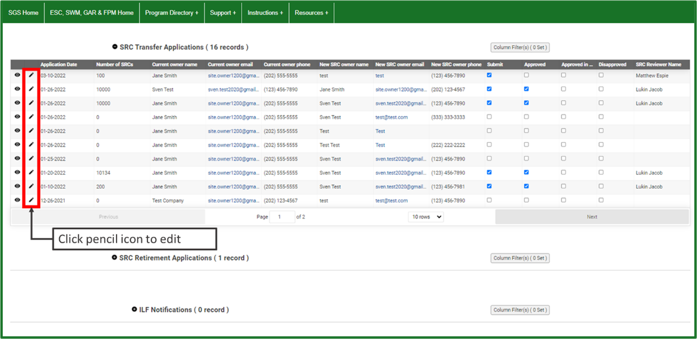

## 3. Confirm the Date to Transfer the SRCs

If you want the SRCs to be transferred on a specific date instead of the
date when DOEE receives and processes the transfer, complete this step.
Otherwise, skip to Step 4.

Go to the ***General Information*** section.

The field ***Application Date*** will default to the date you created
the application.

If you want the SRC transfer to happen on a different date, enter the
date you want the transfer to happen in the field ***Date of Transfer
if different from application date***.

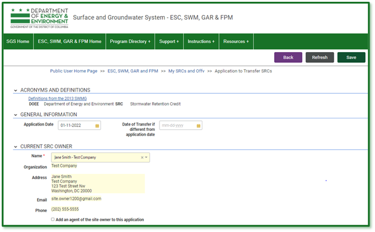

## 4. Enter the Current SRC Owner
Go to the ***Current SRC Owner*** section. If you are the current SRC
owner, select your name in the ***Name*** field. Your contact information will populate automatically.

If you [are not]{.underline} the current SRC owner but are submitting
the transfer as their agent, enter the current SRC owner's name in the
***Name*** field. Then check the box ***Add an agent of the site owner
to this application*** and enter your name in the ***Agent Name***
field. All contact information will populate automatically.

**Note:** You need to have an [agent relationship](User-Guides/Agents-Staff-Guide/agents-and-staff-start.md)
set up with SRC permissions in order to complete the transfer as an
agent of the SRC owner.

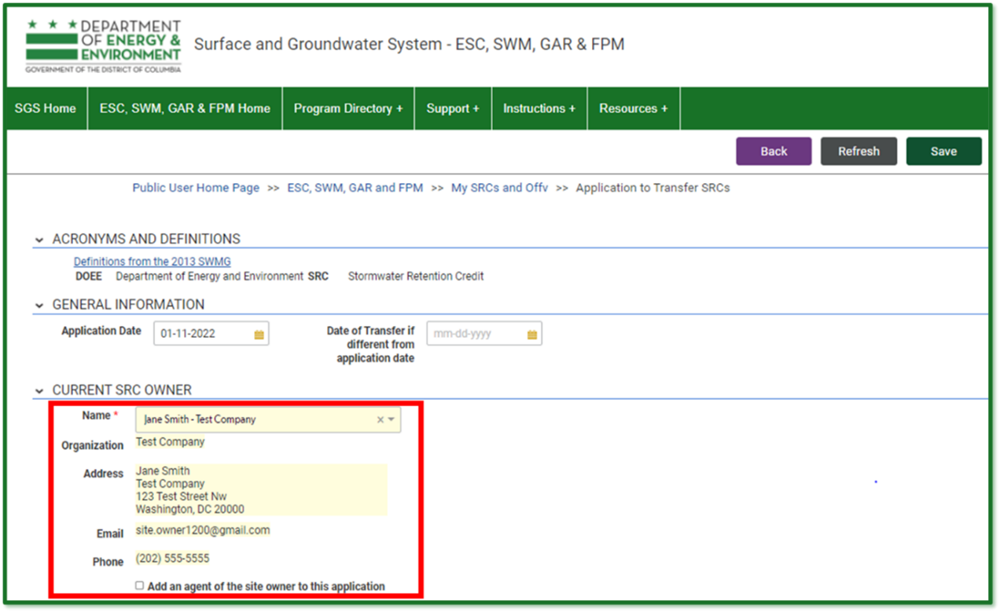
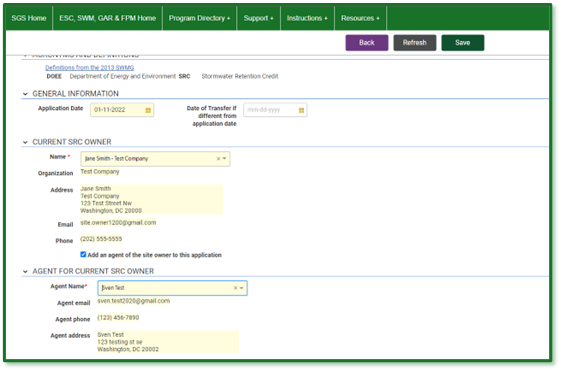

## 5. Enter the New SRC Owner

Go to the ***New SRC Owner*** section and enter their name and contact
information. Required fields have a red asterisk (\*).

Click ***Save***.
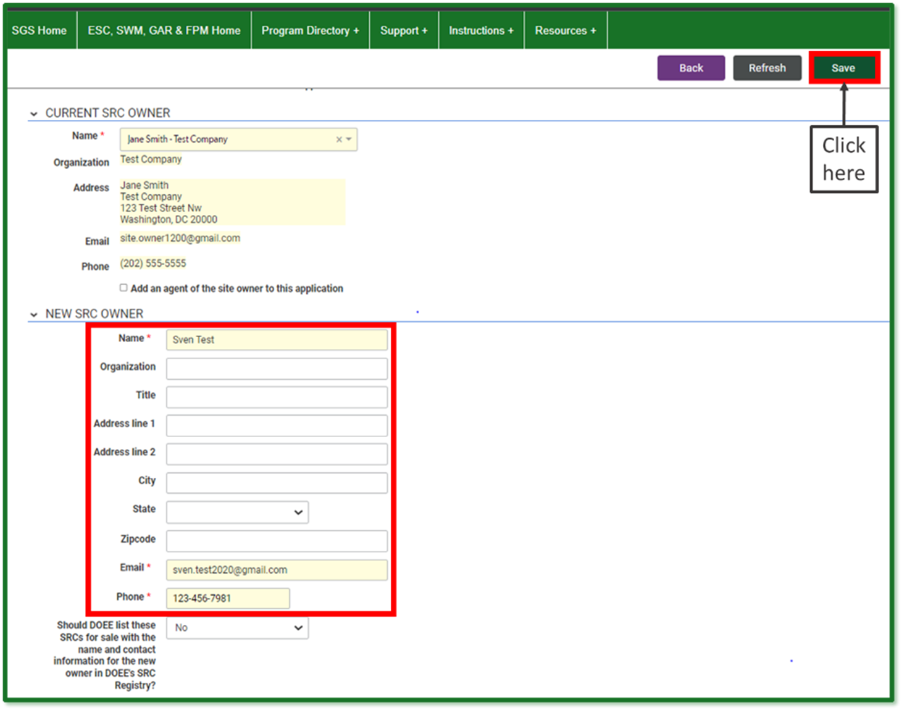

## 6. Select the SRCs to Transfer

Go to the ***SRCs*** section. Click the button ***Select SRCs to
Transfer***. The page will display a list of all SRC ranges that you
could transfer with this application. These are the current SRC owner's
unused SRCs.

Go to the row for the first range of SRCs you would like to transfer and
click the button ***Transfer SRCs from this range***.

Enter the ***Number of SRCs to transfer*** from this range and the
***Sale price per SRC***. When complete, click ***Return to
application***. If prompted, click ***Save***.

Repeat this step for each range you would like to use, until you have
selected all the SRCs you want to transfer.

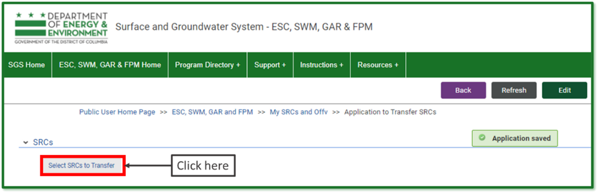
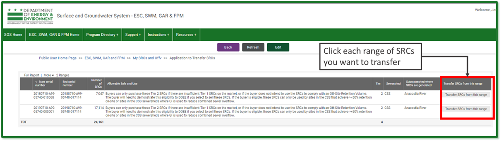
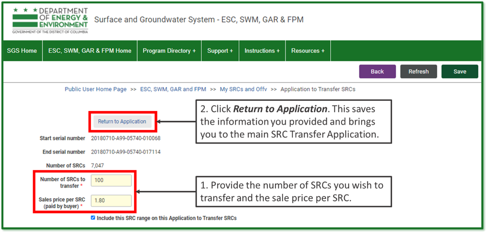

## 7. Sign and Submit Application

Click the button ***Review, Sign, and Submit***. You may need to
scroll to see it.

**Note:** If you need to change the number of SRCs or the sale price,
click ***Edit*** at the top of the form and overwrite the values in the
report. If you do not want to transfer the SRCs, uncheck the box
***Transfer***.

Review your application and click ***Edit*** to make any needed changes.

Click ***Sign and Submit Application***. You may need to scroll to see
it. Read the signature statement and type your name in the Signature
field. Click ***Submit***.

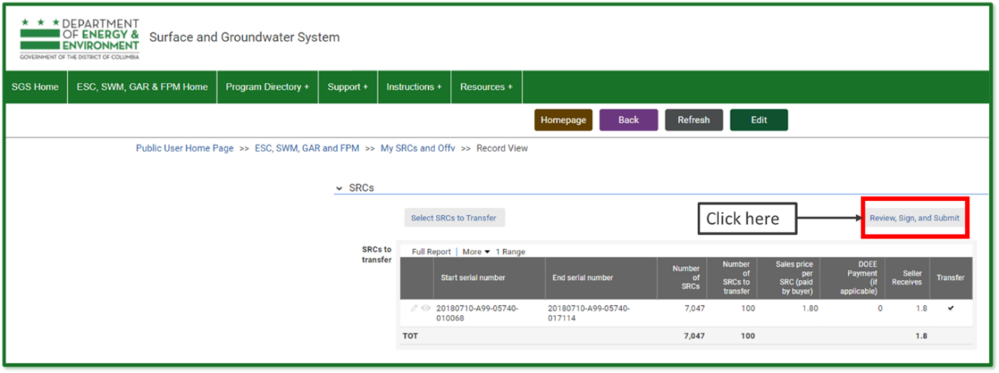
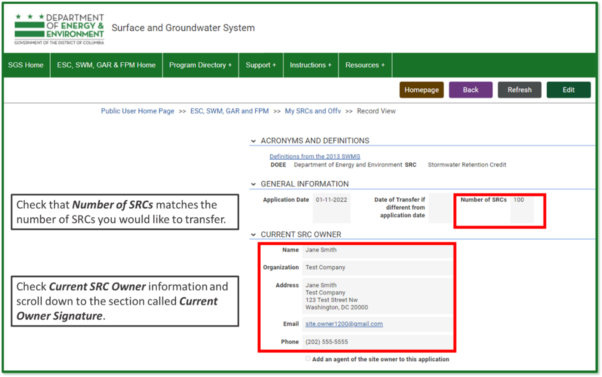
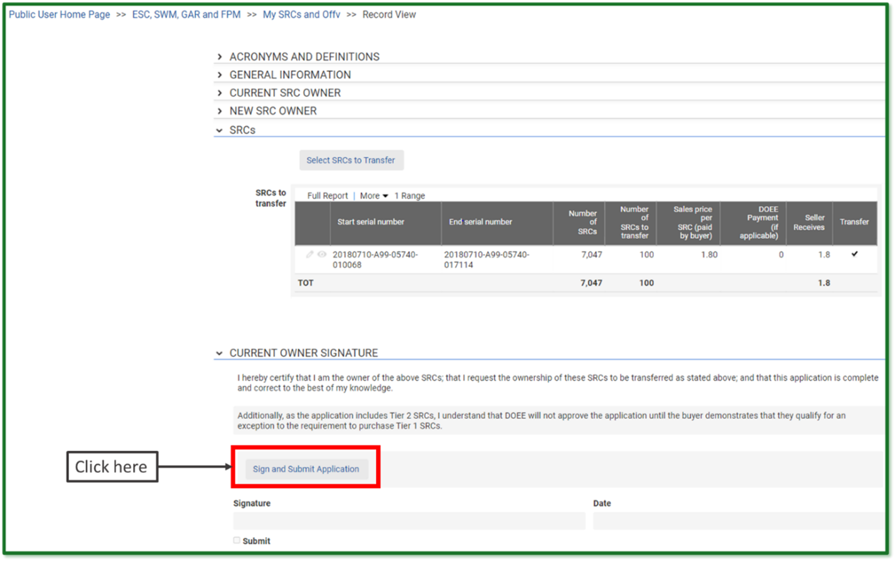
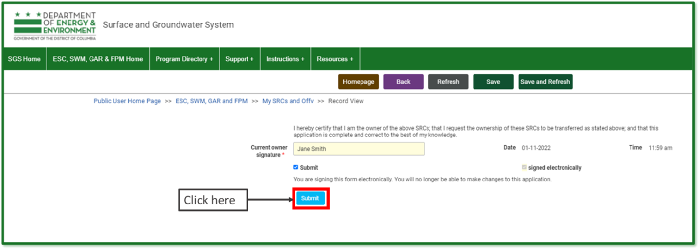

Your saved application should look like this:
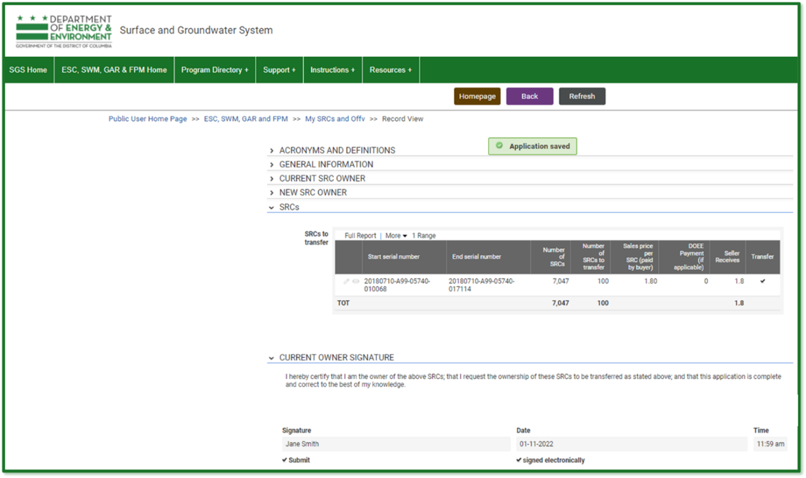

DOEE will review your application and send you an email notification to
confirm that the application is "approved," "approved in part," or "disapproved."

If your application is "approved," DOEE will transfer the SRCs to the
new owner, and you will no longer own them. You will no longer be able
to transfer, use, or retire these SRCs.
