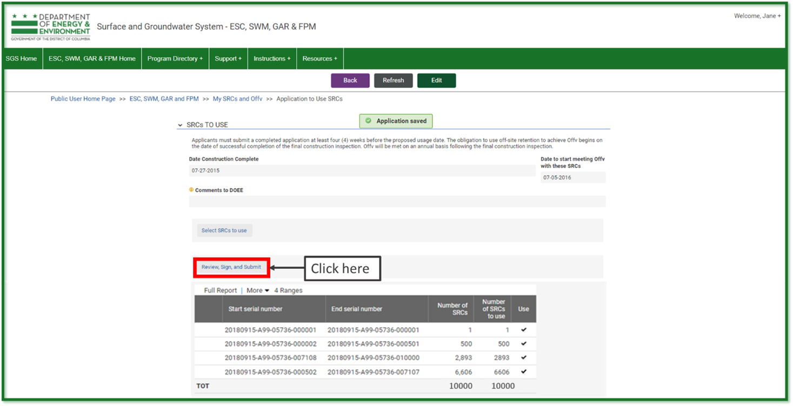

#Use Stormwater Retention Credits
---

[//]: # (1. **[Create a New Use SRCs Form]&#40;##Create a New Use SRCs Form&#41;**)

[//]: # ()
[//]: # (2. **Edit an Existing Use Form**)

[//]: # ()
[//]: # (3. **Enter Information**)

[//]: # ()
[//]: # (4. **Enter the Current SRC Owner**)

[//]: # ()
[//]: # (5. **Select the SRCs to Use**)

[//]: # ()
[//]: # (6. **Sign and Submit Application**)

 This guide has step-by-step instructions and screenshots to help you
 create and submit your form to use Stormwater Retention Credits (SRCs)
 to meet an Off-Site Retention Volume (Offv) using DOEE's Surface and
 Groundwater System (SGS).

 Please note that if you are not the site owner/SRC owner, you'll need
 to [request to be an
 agent](https://octo.quickbase.com/up/bjezqk3qc/a/r325/e6/v0) of the
 site owner/SRC owner.

## Create a New Use SRCs Form

 If you want to edit an existing Use SRCs form, skip to [Edit an Existing Use Form](#edit-an-existing-use-form).

 Log in to the SGS. On the SGS home screen, click ***Erosion,
 Stormwater, Green Area Ratio and Floodplain***, then click ***My SRCs
 and Offv***. Click ***Use SRCs*** to open a new Use SRCs form.

 Skip to [Enter Information](#enter-information).

##Edit an Existing Use Form

 If you have already started a Use SRCs form but have not submitted it
 yet, log in to the SGS and click ***Erosion, Stormwater, Green Area
 Ratio and Floodplain***, then click ***My SRCs and Offv***. Do not
 click the button ***Use SRCs***.

 Instead, scroll down to the section called ***SRC Use Applications***.
 This is where all your in-progress and complete SRC Use forms will be
 listed. Click the pencil icon next to the form you want to edit.

 **Note:** If you click the ***Use SRCs*** button, it will start a new
 form instead of opening an existing one. If this happens, simply click
 ***Cancel*** to exit and remove the new form.

##Enter Information

 Choose the plan number from the ***Plan number*** dropdown for the
 site where you are using SRCs. You need to have access to the site or
 you won't see the plan number in the dropdown.

 If you do not see the site in the dropdown, you may either need to
 [request agent
 access](https://octo.quickbase.com/up/bjezqk3qc/a/r325/e6/v0), or
 [request a change in site
 ownership](https://octo.quickbase.com/up/bjezqk3qc/a/r324/e6/v0).

 Choose the number of years of Offv that you want to meet with this
 application in the field ***Number of years of Offv to meet with this
 application***. You must meet it for a minimum of 1 year, but you can
 meet it for as many years for which you have SRCs.

 If you have the *exact* number of SRCs to meet your Offv for the
 number of year(s) you want, you can choose ***Yes*** in the dropdown
 under ***Do you want to use all of your SRCs for this site?***

 **Note:** If you choose ***Yes***, you do not need to complete Section
 3.

##Enter the Current SRC Owner

 Go to the ***Current SRC Owner*** section. If you are the current SRC
 owner, select your name in the ***Name*** field. Your contact
 information will populate automatically.

 If you [are not]{.underline} the current SRC owner but are submitting
 the Use SRCs form as their agent, enter the current SRC owner's name
 in the ***Name*** field. Then check the box ***Add an agent of the
 site owner to this application*** and enter your name in the ***Agent
 Name*** field. All contact information will populate automatically.

 **Note:** You need to have an [agent
 relationship](https://octo.quickbase.com/up/bjezqk3qc/a/r325/e6/v0)
 set up with SRC permissions in order to complete the Use SRCs form as
 an agent of the SRC owner.

##Select the SRCs to Use

 Click ***Select SRCs to Use***. The page will show a list of all the
 Current SRC Owner's SRCs that may be used with this application. The
 Surface and Groundwater System displays SRCs in groups (ex. SRCs 1
 through 1000). The number of SRCs in each group is listed on each
 line.

 Enter the number of SRCs to use. If you decide you do not want to use
 any SRCs from this SRC range, uncheck the box Use. When complete,
 click ***Return to application***. If prompted, click ***Save***.

 Repeat steps 7 through 9 as necessary until the total number of SRCs
 to use is equal to the amount of Offv you want to meet.

 **Note:** If you wish to change the number of SRCs to use, click
 ***Edit*** at the top of the application and overwrite the values in
 the report. If you do not want to use the SRCs, uncheck the box
 ***Use***.

##Sign and Submit Application

Click ***Review, Sign, and Submit*** once it appears. You may need to
scroll down the page to see it. Review your application to make sure the
information is correct.

Click ***Sign and Submit application***. Read the signature statement
and type your name in the ***Signature*** field. Click ***Submit***.

You're done!

